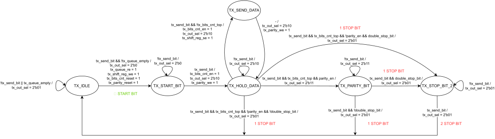
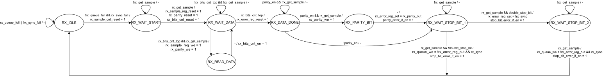
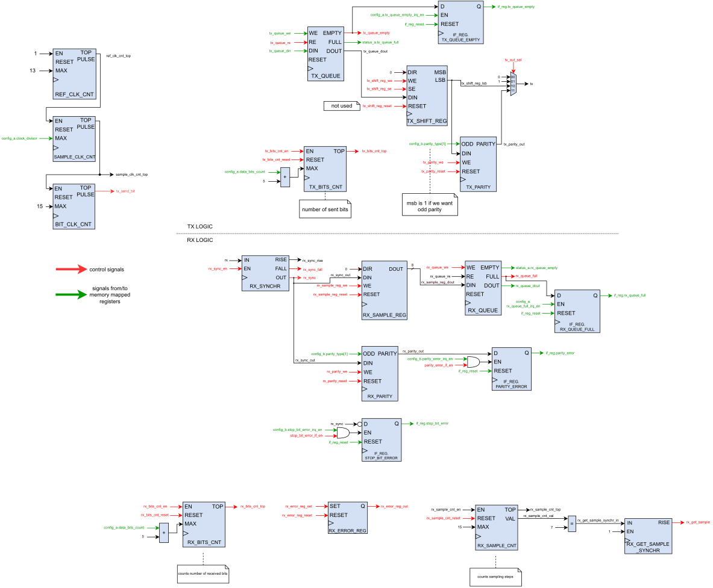

# UART Peripheral
The UART peripheral implements a configurable UART transmitter and receiver. Its meant to be used either "standalone" or using some additional physical layer (such as RS232).

## Suported configurations
- Baud rates: ~7 200 up to ~230 400. See Baud rate table.
- Data bits: 5 - 8
- Parity: none/even/odd
- Stop bits: one/two

### Baud rate table
Baud rate is configured using Config rester A, bits 7-3. See table below for bits values and corresponding standard baud rates.

*Please note that because the main clock cannot be devided precisely, real baud rate will be a bit different (real values are also provided in the table). The error is less than 5 % and so tolerable by majority of UART transceivers.*

| Config value | Corresponding baud rate | Real baud rate |
| ---- | ----- | ------- |
| 0 | 230 400 | 223 214 |
| 1 | 115 200 | 111 607 |
| 2 | 76 800 | 74 404 |
| 3 | 56 000 | 55 803 |
| 5 | 38 400 | 37 202 |
| 6 | 31 250 | 31 887 |
| 10 | 19 200 | 20 292 |
| 14 | 14 400 | 14 880 |
| 22 | 9 600 | 9 704 |
| 30 | 7 200 | 7 200 |

## Verified compatible ICs
The peripheral was tested with FTDI FT2232HQ for both receiving and transmitting.

##  Memory mapped registers
| address | name | access | comment |
| ---- | ----- | ------- | ------ |
| `0xF0000010` | TX data | R+W | enqueue data to send |
| `0xF0000011` | RX data | R | get data from receive queue |
| `0xF0000012` | config register A | R+W | - |
| `0xF0000013` | config register B | R+W | - |
| `0xF0000014` | status register A | R | - |
| `0xF0000015` | interrupt flag register | R+W | - |

### TX data
| bits | usage | comment |
| ---- | ----- | ------- |
| 7-0 | enqueue TX data | add outgoing data to transmission queue |

### RX data
| bits | usage | comment |
| ---- | ----- | ------- |
| 7-0 | access RX data | access first incoming byte in receive queue |

### Config register A
| bits | usage | comment |
| ---- | ----- | ------- |
| 7-3 | clock divisor | divides main frequency and thus determines baudrate |
| 2 | enable irq on TX queue empty | - |
| 1 | enable irq on RX queue full | - |
| 0 | enable irq on parity error | - |

### Config register B
| bits | usage | comment |
| ---- | ----- | ------- |
| 7-6 | parity type | 0: no, 1: even, 2-3: odd |
| 5-4 | data bits count | count = value + 5 |
| 3 | double stop bits | 0: no, 1: yes |
| 2 | enable irq on stop bit error | - |
| 1-0 | reserved | - |

### Status register A
| bits | meaning | comment |
| ---- | ----- | ------- |
| 7 | TX queue full | 1 if TX queue is full |
| 6 | RX queue empty | 1 if RX queue is empty |
| 5-0 | reserved | - |

### Interrupt flag register
*Note: only cleaning (setting to 0) is supported via software. Setting the flag is done via hardware only.*

| bits | meaning | comment |
| ---- | ----- | ------- |
| 7 | TX queue empty IF | - |
| 6 | RX queue full IF | - |
| 5 | parity error IF | - |
| 4 | stop bit error IF | - |
| 3-0 | reserved | - |

## Software support
For now, every memory mapped register is directly available via C firmware library. Check tables above to see which configuration values are availables. For example, to set up standard 9600-8-N-1 mode (9600 baud, 8 data bits, no parity, 1 stop bit), use this short C example:

```c
UART_CONFIG_A = 0xB0; // 1011 0000
UART_CONFIG_B = 0x30; // 0011 0000
```

Then you can write to the TX queue. Do not forget to check whether the TX queue is not full:

```c
if ( ! ( UART_STATUS_A & 0x80) ) {
    UART_TX_DATA = value_to_send;
}
```

Similar code for reading with checking whether the RX queue is not empty:

```c
if ( ! ( UART_STATUS_A & 0x40 ) ) {
    read_data = UART_RX_DATA;
}
```

Interrupt support is not entirely read yet, so please check status register for TX/RX status as in examples above.

## Hardware implementation
As a reference frequency, UART uses system clock (50 MHz), which is then divided to create a main UART clock. The clock frequency is 100/14, which is roughly equal to 3.5714, close to the 1.8432 (8250 UART's clock) times two. This allows to support up to 223 214 bps.

The UART implementation is separated into multiple files. The implementation consists of two main parts: TX logic and RX logic. Every part has its own controller and datapath. Both controllers are implemented with Mealy's finite state machines.

### Clocking
Because the main system clock is different from UART's "clock", we implemented a configurable main clock divider using counters. Output of these timers serve as enable signals for corresponding TX/RX logic.

There are three main "clock dividers". The first one, `REF_CLK_CNT` divides main 50 MHz system clock to a reference clock of 3.5714 MHz. Then this value is divided by a configurable divider, `SAMPLE_CLK_CNT`, which then outputs a clock that is 16 times faster than requested baudrate. This fast clock is used by RX logic to sample incoming bits. And finally, this clock is then divided by `BIT_CLK_CNT`, its output is used by TX logic to send bits to output.

*Important: we use main system clock everywhere, using "divided clocks" is solved using enable signals. No clock gating is present here, so no timing hazards occur.*

### Queueing
For both TX and RX there are hardware queues present. As for now, these queues have capacity of 16 bytes. These queues are directly available in software by reading or writing to corresponding registers.

### Parity calculation
Parity (if requested), is computed and validated using serial parity calculator. It is configurable to use either even or odd parity.

### TX controller
TX controller is implemented using FSM. You can check the diagram below:



The controller is responsible for correctly timing sending of the particular bits and correctly handling configured parameters (count of data bits, parity...).

### RX controller
RX controller is also implemented using FSM:



It is more complicated than RX, mainly because it has to synchronize with incoming transmission and then correctly sample incoming bytes (in the middle of the signal). Sampling frequency is dictated by `SAMPLE_CLK_CNT` (see Clocking).

### Datapath
The datapath consists of three parts. The first part, apparent in the diagram on the left, is common for both RX and TX logic. Then, second part implements TX logic. Finally, third part implements the RX logic.

In the diagram below, there is no visualization of register set. Every register I/O is marked by green arrow instead. Similarly, all controller-related signals are represented by red arrows.

